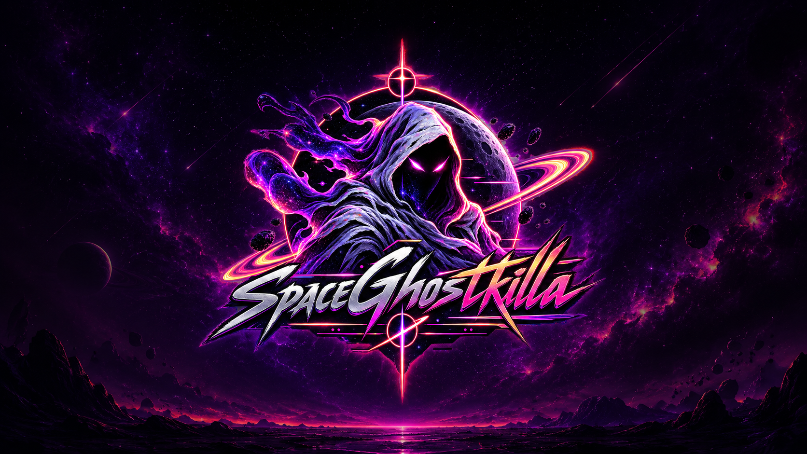

<div align="center">



<br />

### PHANTOM PROTOCOL // SECURITY RESEARCH NODE

[](https://github.com/jordanistan/spaceghostkilla/actions/workflows/pages.yml)
[](https://jordanistan.github.io/spaceghostkilla/)
[](.well-known/security.txt)

</div>

---

## What this is

**SpaceGhostkilla** is a dependency-free static website presented as a personal security research node. It's built around a cosmic hooded-ghost identity and a dark, terminal/synthwave aesthetic — the site itself doubles as a demonstration of clean, framework-free front-end engineering (plain HTML, CSS, and JS, no build tooling required).

The content frames vulnerabilities as **engineering problems**: understand the condition, model the impact, detect the signal, remove the root cause — explained defensively, without shipping weaponized exploit chains.

<div align="center">

</div>

## What it does

| Section | Purpose |
|---|---|
| **Intel Node** | States the site's research posture — focus areas, methodology, and disclosure model. |
| **Vulnerability Index** | A filterable grid of common vulnerability classes (Injection, Broken Access Control, XSS, SSRF, Auth Bypass, Secrets Exposure, Supply Chain Risk, Cloud Misconfiguration) — each paired with its defensive focus, not exploit steps. |
| **Field Notes** | Short essays on root cause analysis, detection engineering, and remediation patterns. |
| **Operator Terminal** | A themed, JS-driven fake terminal used as a stylized navigation console. |
| **Responsible Disclosure** | The ground rules for reporting issues, plus a real [`security.txt`](.well-known/security.txt) contact. |

Visual flourishes — animated starfield canvas, scroll reveals, scanlines, glow — are all hand-rolled in [`script.js`](script.js) and [`styles.css`](styles.css), no external libraries.

## Live site

▸ **https://jordanistan.github.io/spaceghostkilla/**

Deployed automatically on every push to `main` via GitHub Actions → GitHub Pages.

## Run locally

Open `index.html` directly, or serve the folder:

```bash
python -m http.server 8080
```

Then visit `http://localhost:8080`.

### Or with Docker

```bash
docker build -t spaceghostkilla-preview .
docker run -d --name spaceghostkilla-preview -p 8080:80 spaceghostkilla-preview
```

Then visit `http://localhost:8080`.

## Deploy

Pushing to `main` triggers [`.github/workflows/pages.yml`](.github/workflows/pages.yml), which stages the static files and publishes them to GitHub Pages. The site can just as easily be deployed to Cloudflare Pages, Netlify, Vercel, or any ordinary web server — it's plain static files.

## Structure

```
.
├── index.html                          page content
├── styles.css                          theme, responsive layout, effects
├── script.js                           starfield, filters, terminal UI
├── 404.html                            themed not-found page
├── robots.txt
├── site.webmanifest
├── assets/                             logo, wallpaper, favicon
├── .well-known/security.txt            responsible disclosure contact
├── .github/workflows/pages.yml         build + deploy to GitHub Pages
└── Dockerfile                          nginx-based local preview
```

## Responsible disclosure

Found a real issue with this site or its infrastructure? Report it per [`.well-known/security.txt`](.well-known/security.txt) — **security@spaceghostkilla.com**. Research shown on the site is intended for systems you own, authorized labs, and coordinated disclosure only.
